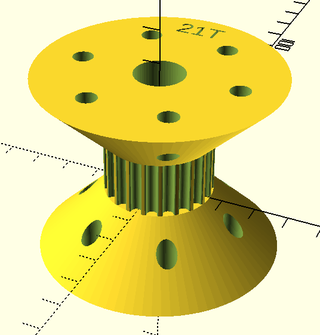
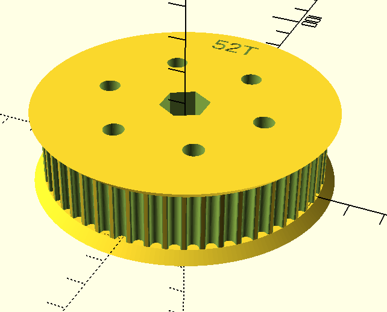
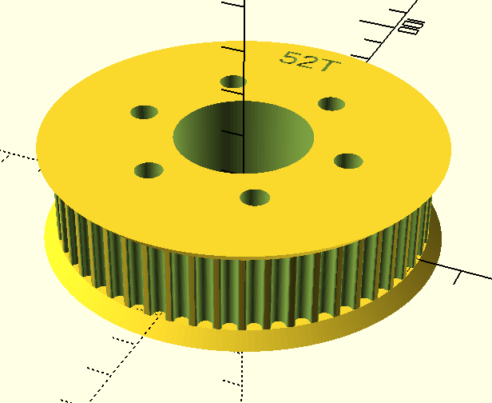
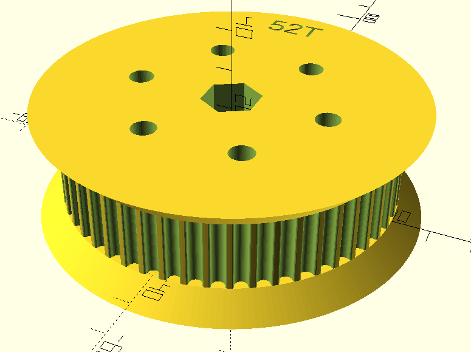

# FRC pulleys

3D-printed parametric pulley generator for FRC robotics

- Works with [AndyMark 42-tooth pulley (am-2234a)](https://www.andymark.com/products/42-tooth-5-mm-htd-15-mm-wide-bearing-bore-plastic-pulley)
- Holes for [AndyMark hubs](https://www.andymark.com/products/andymark-hub)

## Gallery

### [pulley_21t](stls/pulley_21t.stl)

### [pulley_52t_hex_shaft](stls/pulley_52t_hex_shaft.stl)

### [pulley_52t_hub](stls/pulley_52t_hub.stl)

### [pulley_52t_hex_shaft_6mm_retainer](stls/pulley_52t_hex_shaft_6mm_retainer.stl)
